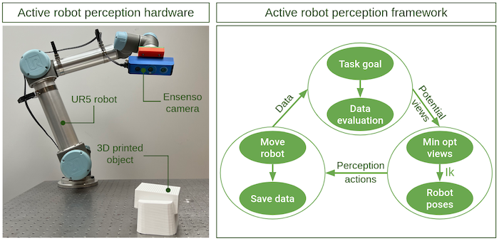
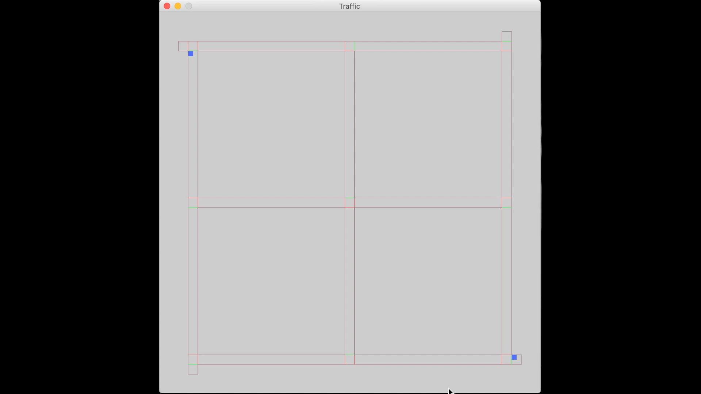
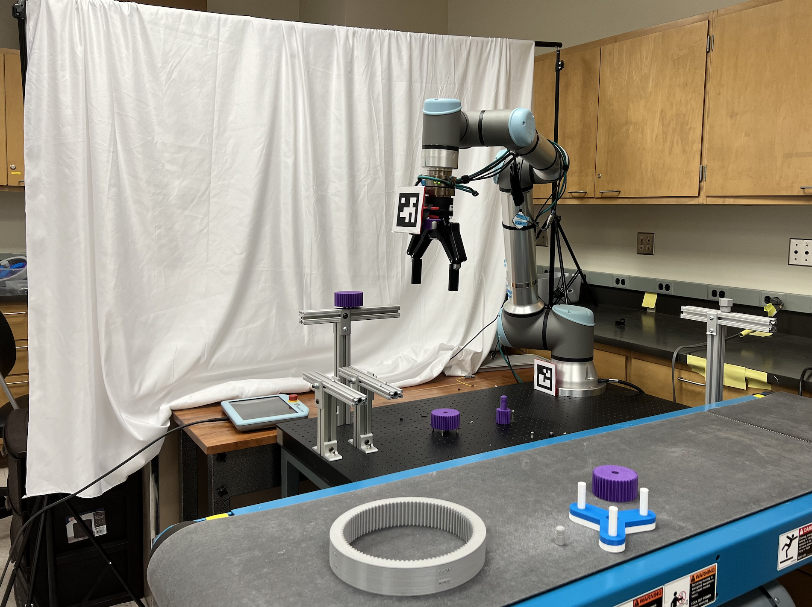

> "Rolling in the muck is not the best way of getting clean."
> --- Aldous Huxley

# Research projects

Research projects during Ph.D.

## Motion-force control for material removal

[Robotic chamfering and deburring of gears](./projects/project-1.html).

  

[Robotic grinding of tubes](./projects/project-2.html).

  

[Robotic sanding](./projects/project-3.html).

  

## Robot perception

[Next-best-view for object pose estimation](./projects/project-4.html).

  

[Active perception strategies for object pose estimation](./projects/project-5.html).

  

## MISC

[Reinforcement learning for traffic control](./projects/project-6.html).

  

[Robotics training program](./projects/project-7.html).

  

[Human-robot interaction](./projects/project-8.html).

  

[Optimization for robot perception](./projects/project-9.html).

