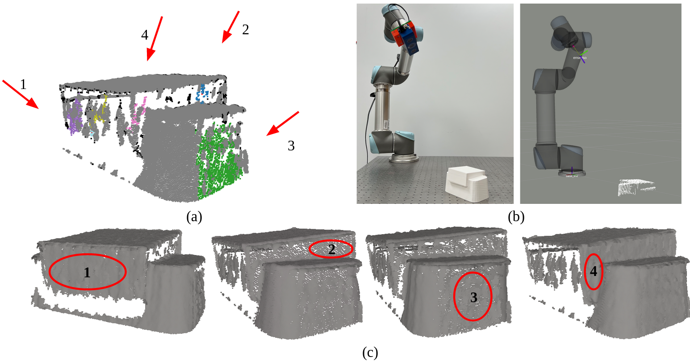
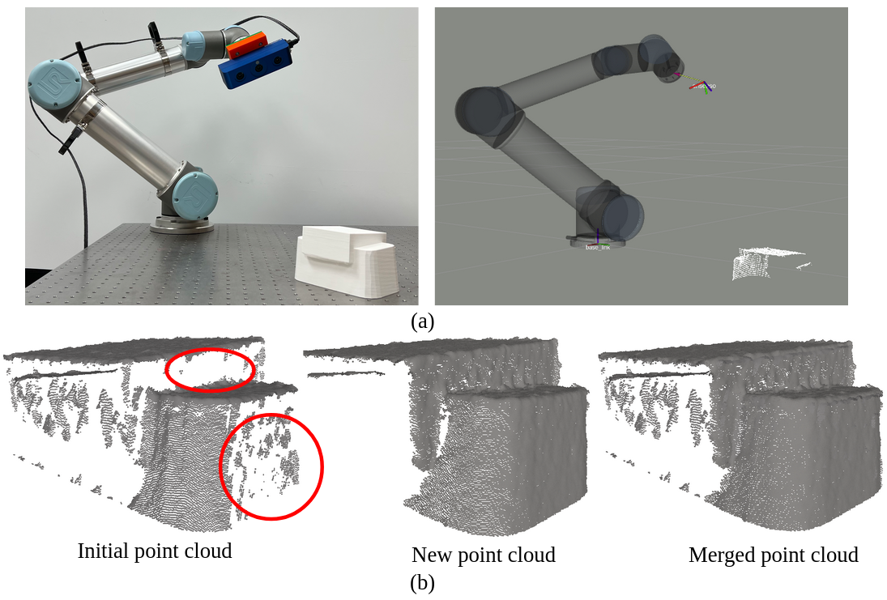

Keywords: active robot perception; point cloud processing; object pose estimation; 

The key differences between this project and the NBV project are:
1. Point clouds are analyzed using general quality and quantity criteria
2. Potential sensor views are found by formulating and solving optimization problems
3. Robot inverse kinematics are also solved through optimizations
 

 
The sensor views (a) and robot poses (b) to collect point clouds after point cloud analysis, and the collected point clouds (c).
 

 
The generated robot pose (a) to collect point clouds based on the active robot perception framework and the collected point clouds (b).
 

 
The details of the methods are included in a paper, which is currently under review. 

[Back to main](https://jhugj.github.io/web-repo/)