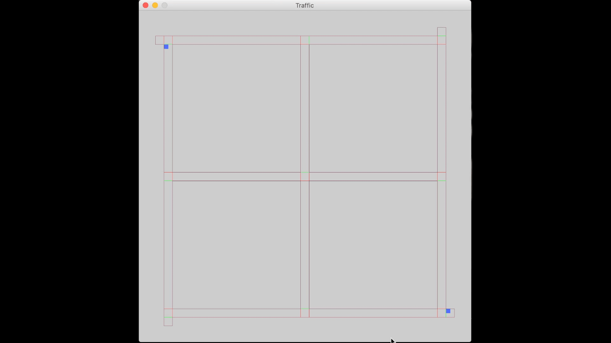

Keywords: reinforcement learning; SARSA; traffic control

A simplified traffic system with three horizontal roads and three vertical roads is used in simulation. Vehicles come into the system from four departure locations (four corners) and end in four destination locations (four corners). There is a traffic light at each intersection to regulate the traffic flow. The colors of the intersection cubes indicate the traffic light colors of the corresponding lanes. Each vehicle (moving cube) makes decision at each intersection and chooses one lane to turn to.
 

 
The key evaluation metric is the number of vehicles that have reached their destination within a predefined time (throughput). I set up the infrastructure using [pyglet](http://pyglet.org) and integrated the infrastructure with the vehicles from other teams. 

[Back to main](https://jhugj.github.io/web-repo/)